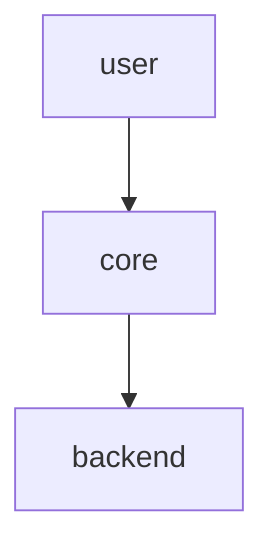

# Prose and Links

Read this file when writing or editing Markdown prose, README files, ADRs, design documents, documentation comments, or natural-language source comments.

## Semantic line breaks

Do not insert a newline inside a natural-language sentence merely because the line is long.

Line breaks should express semantic structure, not visual column width.

If a line feels too long:

1. shorten the sentence
2. split it into multiple sentences
3. convert parallel conditions into a list
4. move excessive local detail into an appropriate document

Prefer one logical paragraph per physical line unless the repository intentionally uses sentence-per-line prose.

Bad:

```md
This command validates the workspace and reports diagnostics
for all configured providers before writing output.
```

Good:

```md
This command validates the workspace and reports diagnostics for all configured providers before writing output.
```

Also acceptable:

```md
This command validates the workspace.
It reports diagnostics for all configured providers before writing output.
```

## File references in Markdown prose

When referring to a repository file in Markdown prose, use a Markdown link whenever practical.

Prefer:

```md
See [the runtime requirements document](docs/generated-installer-runtime.md).
```

Avoid:

```md
See docs/generated-installer-runtime.md.
```

Use descriptive link text when the role of the file matters.

A path may remain inline code when it is a literal value, command argument, output, or syntax example.

Example:

```md
The default configuration path is `reportage.kdl`.
```

Do not invent links to files that do not exist unless the task explicitly proposes those files.
When proposing a new file, make its proposed status clear.

## Link exceptions

Do not linkify paths inside:

- code blocks
- terminal examples
- generated snapshots
- machine-readable configuration
- quoted source material
- literal command or syntax examples
- formats that do not support Markdown links

## Diagrams

Draw diagrams with mermaid in a fenced ```mermaid block. Do not draw them as ASCII art.

A diagram is content that depicts structure, flow, sequence, hierarchy, or state — anything a reader parses as boxes, arrows, or branches. Prefer mermaid whenever the content is one of these, because a rendered diagram survives reflow, is searchable as text, and can be corrected without redrawing alignment by hand.

Bad:

````md
```txt
user
  |
  v
core
  |
  v
backend
```
````

Good:

````md

````

Choose the diagram type that matches the content:

- `flowchart` for structure, control flow, and decision branches
- `sequenceDiagram` for ordered interaction between components
- `stateDiagram-v2` for lifecycle and state transitions
- `erDiagram` for data relationships

### What is not a diagram

Leave these as ordinary fenced blocks. Converting them to mermaid obscures rather than clarifies:

- data structures and field listings
- example values, payloads, and configuration fragments
- terminal sessions and command output
- directory and file path listings
- ordered prose steps, especially when they carry normative statements such as what must not happen

### Mermaid authoring cautions

- Quote every node and edge label, so punctuation does not break the parser.
- Avoid `--` inside an edge label. It is parser-hostile even when quoted. Move the affected text into a node, or reword the label.
- Use `<br>` for line breaks inside a label rather than splitting the node.
- Keep label text identical in meaning to the prose it accompanies. A diagram is a second rendering of a claim, not a new claim.

### Existing ASCII diagrams

Convert an existing ASCII diagram when you are already editing the document for another reason, or when asked to.

Take more care in a file whose content is meant to be stable, such as an accepted ADR. Converting the drawing is a formatting change and is permitted, but the diagram must preserve the original's meaning exactly. Do not add, drop, reorder, or reinterpret anything while converting.

## Source comments

Do not split one comment sentence across multiple lines merely because of width.

Bad:

```ts
// The runner captures stdout and stderr separately so that
// callers can assert stream-specific behavior.
```

Good:

```ts
// The runner captures stdout and stderr separately so callers can assert stream-specific behavior.
```

Also good:

```ts
// The runner captures stdout and stderr separately.
// This lets callers assert stream-specific behavior.
```

When comment content becomes too large, move the durable explanation into a design document or ADR and leave a short local summary plus a link.

## Documentation comments

Split documentation comments at semantic boundaries.

Prefer:

```ts
/**
 * Parses the workspace path.
 *
 * Rejects absolute paths, empty paths, parent-directory segments, and paths that cannot be normalized safely.
 */
```

Use a list when the items are independently important.

## Allowed line breaks

A prose line break is appropriate for:

- a new paragraph
- a heading
- a list item
- a table row
- a code block boundary
- a sentence boundary in sentence-per-line repositories
- a deliberate separation between distinct comment statements
- format-required output

## Fidelity exceptions

Preserve hard line breaks when required by:

- exact quotations
- poetry or verse
- tables
- code blocks
- generated snapshots
- terminal output
- formatter-controlled source code
- an explicit repository convention

Apply exceptions narrowly.
